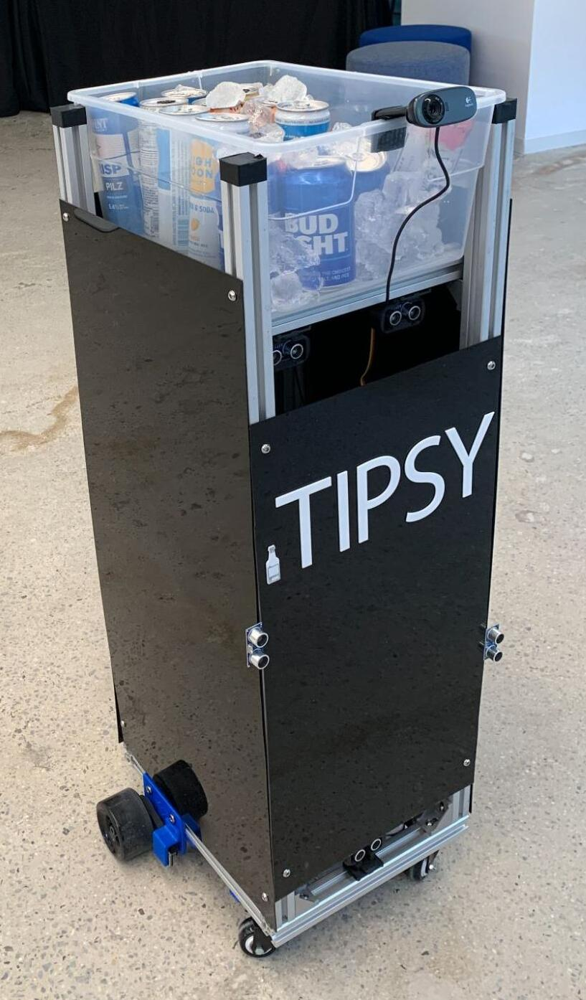

## Welcome to Viam's `Tipsy` project!

Made by [Kevin Ho](https://www.linkedin.com/in/hokevins), for the candidacy of the **Senior Developer Advocate role at Viam** on 06/23/2023.

_Thank you for your time in reviewing my project._

### Future Ideas for Project Expansion

* Integrate a speech provider, like ElevenLabs, to provide Tipsy with a VUI (vocal user interface) for more seamless human interactions.
* Integrate a VSLAM navigation algorithm, similar to that of Roomba, to help Tipsy mingle more effectively in the space.
* Integrate a weight sensor, to help Tipsy know when to replenish its own supply of drinks in the kitchen.
* Integrate a vision service, to help Tipsy recognize when it's being hailed by a guest.

---

## Project Specs from Matt Vella, Head of Developer Relations of Viam

Are you tired of constantly making trips to the fridge during a party just to replenish everyone's drinks? Are your guests tired of going to grab their own drinks? Well, now everyone can sit back and relax while Tipsy takes care of all your beer carrying needs.

* Let's create an autonomous drink carrying robot. Tipsy makes it easy to replenish everyone’s drinks at a party.
* Tipsy's hardware consists of a [Scuttle rover](https://www.scuttlerobot.org/product/scuttle-v3) as a motorized wheeled base, a [Raspberry Pi](https://a.co/d/bxEdcAT), a webcam, an IMU sensor, and one or more [ultrasonic sensors](https://www.amazon.com/WWZMDiB-HC-SR04-Ultrasonic-Distance-Measuring/dp/B0B1MJJLJP/ref=sr_1_4).
* Tipsy's software consists of the [viam-server](https://docs.viam.com/installation/#install-viam-server) and the [Viam Python SDK](https://python.viam.dev/).
* You will also need access to the [Viam App](https://app.viam.com/robots) for robot configuration and setup.

### Robot Stories

1. As Tipsy, I can detect the presence of obstacles in my surrounding area, so I can avoid them using my ultrasonic sensor distance measurement(s).
2. As Tipsy, I can stop in the presence of obstacles, so I can avoid collisions.
3. As Tipsy, I can move backwards and reorient myself, so I can self-heal getting stuck and/or tipping backwards in the event of a collision. If an object is not in the field of detection for the ultrasonic sensor(s) and an impact occurs, I can use my IMU (inertial measurement unit) sensor for orientation detection.
4. As Tipsy, I can detect the presence of people in my surrounding area, so I can move towards them with ease using my camera and machine learning model.
5. As Tipsy, I can pause once I am near a person, so that my guests can grab a drink within arm's reach.
6. As Tipsy, I can mingle randomly in the space, so that my guests are continually refreshed without ever having to leave their spot.

### Additional Project Requirements

1. When using found code from our resources below, please focus on uplifting the code in any way you see fit.
2. Make the number of ultrasonic sensors configurable, e.g. allow one to have a config variable that says it should use X number of ultrasonic sensors.

### Additional Project Guidelines

1. Since you don’t have the hardware to test, we don’t expect this to be working code! Note that the Viam rovers in the Try experience don’t have an ultrasonic sensor, so you will not be able to test your code there either.
2. Don't over-engineer the robot mingling feature. Randomness is okay, so there's no need to track individual people or where Tipsy has been. The only requirement is for Tipsy to not get stuck next to the same person.
3. This project uses pre-trained machine learning packages. To use the provided machine learning model, copy `effdet0.tflite` and `labels.txt` to your Raspberry Pi.
4. The ultrasonic sensor is implemented as a generic sensor component, so it can use the [get_readings() method](https://python.viam.dev/autoapi/viam/components/sensor/sensor/index.html#viam.components.sensor.sensor.Sensor.get_readings), which returns a dict of key-value pairs. For the ultrasonic, the only key is `“distance”` (in meters) - so the following code would print the distance in meters to the closest object.

```python
from viam.components.sensor import Sensor
ultrasonic = Sensor.from_robot(robot, "ultrasonic")
result = await ultrasonic.get_readings()
print(result["distance"])
```

### Viam Resources

* [Tutorial - Create an Autonomous Drink Carrying Robot](https://docs.viam.com/tutorials/projects/tipsy/): Tipsy hardware assembly and base code
* [Tutorial - Use Object Detection to Turn Your Lights On](https://docs.viam.com/tutorials/projects/light-up/): uses a ML model to detect people
* [Tutorial - Drive the Viam Rover with the Viam SDK](https://docs.viam.com/tutorials/get-started/try-viam-sdk/): shows how to programmatically drive a robotic base


